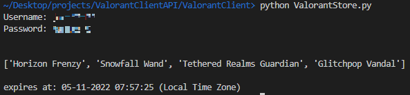

# Valorant Client API

A repo that provides a way to replicate a Valorant PC Client,
so that we can view our account without having to directly be logged in at a PC.

It takes an OOP approach to replication of the client, so that we can more easily build features in the future.

## ValorantClient.py

Built off the AIOHttp library's ClientSession module, which creates async HTTP Client sessions.

Currently supports the below features:

1. Authentication / log in
2. [View Valorant Store](#tutorial---view-daily-valorant-store)

## Requirements and Installation

1. Ensure you have Python >= 3.6 installed on your machine
2. Clone this repo
3. Create + Activate a virtual environment
4. run `pip install -r requirements.txt` inside your virtual environment

## Tutorial - View Daily Valorant Store

In order to view your Daily store:

1. run `ValorantStore.py`
2. Enter your username and password

You'll then see you're store for the day along with what time it expires.

Credit to RumbleMike for laying the foundation to this project -
[Docs](https://github.com/RumbleMike/ValorantAPI/)
